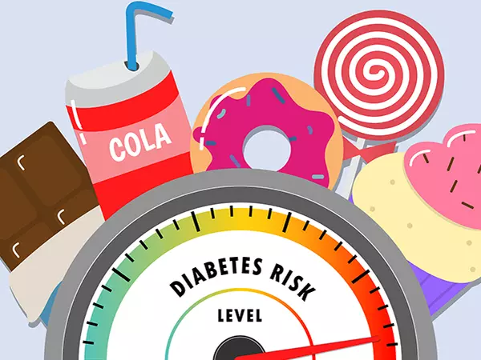

# Data Scientist

#### Technical Skills: Python, SQL, R, MongoDB, Neo4j, Tableau, Machine Learning

## Education								       		
- M.Sc., Applied Analytics	| Columbia University, New York (_December 2024_)	 			        		
- B.A., Political Science | Delhi University, India (_June 2020_)

## Work Experience
**Data Science Intern- Revenue Management @ Roland Foods (_May 2024 - Present_)**
- Developed an end-to-end summarization tool using Generative AI (RAG, T5) and NLP (SpaCy) for targeted Claims and Contracts retrieval reducing document review time, Integrated user-friendly deployment via Flask
- Developed and implemented a demand and supply replenishment tool with automated emails using Power Automate, leading to a $300K inventory reduction in 6 weeks by analyzing stock levels and identifying excess inventory, improving turnover and communication efficiency
- Created pricing models in Python for Excessive, Discontinued, and Expired (EDE) items to maximize revenue from the EDE product pipeline
- Redesigned and updated the Active Items Report using D365, ensuring data integrity through logic checks and regular updates in Tableau, facilitating informed decision-making across departments

**Technicala Business Analyst @ Statiq (_November 2021 - August 2023_)**
- Developed an automated NLP pipeline using TextBlob for sentiment analysis and CountVectorizer for keyword extraction to transcribe and analyze customer service calls, assess representative performance, and identify product-related issues
- Led project management of the Charger Tracking System using tools like Power Automate, QuickSight, and MS Excel in use by 6 departments of the organization; reduced TAT time by 12 days, cutting down the number of internal emails by 78%
- Executed exploratory data analysis to understand historical supply chain performance and forecasting future demand for Chargers, resulting in a 15% reduction in stockouts and excess inventory
- Utilized and deployed ML models for analyzing transportation, achieving a 20% reduction in lead times and cost savings
- Automated Workflow Processes, Reporting, Task and Inventory Management using Power Automate and Zapier, resulting in real-time KPI tracking for project managers, streamlining routine and manual tasks, reducing errors and improving efficiency
- Utilized SQL extensively in day-to-day work for data querying, manipulation, and analysis, enabling efficient extraction of insights and support for decision-making processes
- Implemented supervised learning for EV charging operations, achieving an 18% downtime reduction with 92% accuracy in real-time fault detection
  
**Business Intelligence Analyst @ Statiq (_August 2021 - November 2021_)**
- Examined market strategies by analyzing competitor products; identified and extracted data metrics using Python for web scrapping, performed Exploratory Data Analysis, drove Business development strategies by tracking insights
- Streamlined documentation processes by creating and maintaining Standard Operating Procedures (SOPs) using Confluence, reducing content redundancy and improving overall document efficiency by 20%.
- Utilized SQL and Python to analyze in-house IoT-generated datasets, driving data-driven decisions and achieving a 27% improvement in operational efficiency during the start-up’s initial stages.
- Collaborated with cross-functional teams to design and maintain dashboards and reports for Department heads and C-level executives using Power BI and Amazon Quicksight

**Market Research Analyst @ Publicis Groupe, Arc Worldwide (_June 2020 - July 2021_)**
- Created a marketing mix model by leveraging regression analysis to optimize paid ads budget leading to a decrease in spending by 7% for HP India
- Performed multiple regression analysis on the NPS score of HP retail stores in Karnataka and suggested corrective market strategies led to an increase of 6% in NPS score in 4-months
- Strategized and analyzed the performance of Digital campaigns for Raskik, generating 73% surge in followers on Facebook and Instagram along with a 21% increase in website traffic

## Projects
### AI Powered Customer Support Chatbot: BrewAI

Developed an end-to-end personalized AI chatbot for a coffee shop using PyTorch and NLTK, incorporating a feedforward neural network and NLP techniques like tokenization, stemming, and bag-of-words to improve customer interactions. This chatbot was designed to handle queries about menu items, store locations, and promotions, providing real-time responses directly on the website. With an intent recognition accuracy of 85%, the system reduced query resolution time by 20%. In its first three months, the chatbot processed over 2,000 inquiries, reducing human intervention by 30% and boosting customer satisfaction by 25% based on follow-up surveys. As an end-to-end project, I managed everything from data collection and model training to deployment and ongoing optimization, enhancing both user experience and operational efficiency

### Predictive Insights: NYC Taxi Tip Forecasting and Receipt Probability Analysis
[Publication](https://github.com/Musksss/NYC-Taxi-Tip-Forecasting))

Directed the NYC Taxi Tip Prediction project, orchestrating comprehensive data analysis and predictive modeling endeavors. Employed **R** programming alongside libraries such as **ggplot2**, **caret**, and **mgcv** to delve into the intricacies of NYC taxi trip data. Segmented datasets using advanced data partitioning techniques and crafted visualizations to discern nuanced relationships between variables. Implemented a spectrum of predictive models, including **linear regression** and **logistic regression**, to forecast tip amounts and predict tip receipt probabilities based on factors like trip distance, time of day, and passenger count. Executed rigorous testing and evaluation, including **Root Mean Squared Error** (RMSE) calculations for regression models and **Receiver Operating Characteristic** (ROC) curve analysis for logistic regression, to validate the robustness of models on test datasets. This project underscores proficiency in statistical analysis, data visualization, and predictive modeling techniques across diverse domains.

### Car Price Prediction
[Publication](https://github.com/Musksss/How-much-is-your-car-worth-)

Led a comprehensive analysis for the Kaggle Car Price Prediction competition, utilizing **R** for data exploration, preprocessing, and model selection. Implemented a range of machine learning models including **xgboost**, **linear regression**, and **random forest**, optimizing model performance based on root mean square error (**RMSE**). Documented the analytical process and diagnostic steps for model enhancement, showcasing a retrospective understanding of predictive modeling complexities.

### Empowering Futures: Career Design Lab's blueprint for Applied Analytics graduates

Crafted and spearheaded the development of an Enhanced Job Search Model, leveraging my expertise in **Tableau** to create diverse types of visualizations and interactive dashboards tailored for students at Columbia University's School of Professional Studies, particularly those in the Applied Analytics program. Additionally, I utilized **Python** for in-depth analysis, extracting actionable insights from complex datasets. I transformed data into comprehensive career guidance resources by employing advanced visualization techniques, such as heat maps, scatter plots, and interactive filters, empowering students with valuable insights for their post-graduate employment endeavors. This project highlighted my proficiency in both Tableau and Python and showcased my ability to utilize these tools effectively in data-driven projects.

### The Weeknd World Tour: Dawn's Echo

Engaged in a project that brought together abilities to gather necessary datasets to support the operation of a twelve-month worldwide concert tour for The Weeknd. Converted the datasets into a functioning relational database, utilizing the data to run the tour and its peripheral businesses. Datasets were gathered to successfully organize and run the tour, including digital assets (images, videos) to enhance the app. Normalized (to 3NF), extracted, transformed, and loaded (**ETL**) the necessary pieces from the raw datasets to create a fully functioning relational database. Server space was provided to house the database. Built a Shiny app in R to showcase the results interactively and intuitively. The app connected to the database and contained all the SQL queries used to supply the data needed for the user to engage in the app. 

Users could view the dates and locations of each concert event during the tour. They had the opportunity to explore The Weeknd's musical assets, such as their discography, sample music videos, and lyrics to their popular songs, and buy merchandise. Users could plan a visit to the concert location city by having options for lodging, dining, and activities. Each user was also entered into a raffle to win a private concert ticket.

The project demonstrates proficiency in **SQL** (PostgresQL), **relational database management**, and **R programming** through the development of a Shiny web app for The Weeknd's world tour, integrating diverse datasets and providing interactive user engagement.

### Predicting Diabetes Onset: Examining the Interplay Between Demographics, Medical Conditions, and Lifestyle Factors

This project is focused on improving our ability to predict the onset of diabetes by examining the intricate relationship between demographics, medical problems, and lifestyle decisions. The goal of the project is to create a prediction model to identify individuals at risk of developing diabetes. Advanced statistical methods, including **logistic regression**, **random forest**, and **gradient boosting** models, are utilized. Meanwhile, the prediction model is developed using comprehensive datasets containing diverse demographic variables, medical histories, and lifestyle habits, including smoking status. All these analyses are conducted using **R** and **RStudio**.

### Brewing Success: Enhancing Independent Coffee Shop Visibility Through Online Reviews
[Publication](https://github.com/Musksss/Research-design-whats-brewing/tree/main)

Employing **R** for analysis, this research study delved into pertinent inquiries within the coffee shop industry, employing robust statistical methodologies. **Descriptive statistics**, including mean, median, mode, and standard deviation, offered a comprehensive understanding of data distribution. Further, the study utilized the **two-sample one-sided proportion test** to ascertain the significance of disparities in customer visit intentions concerning response strategies. This investigation revolves around the impact of coffee shop owner responses on customer visit intentions, coupled with the influence of response tone. Objectives encompass scrutinizing the effect of owner responses on customer visit intentions and evaluating how response tone—whether formal or casual—affects customer perceptions. Through the adept use of advanced statistical techniques and simulations, the aim is to furnish nuanced insights into customer behavior amidst the digital landscape.

## Skills
**Machine Learning** (Supervised & Unsupervised Learning, Classification, Regression, Clustering)
**Data Modeling** (Feature Engineering, Model Evaluation, Hyperparameter Tuning)
**Deep Learning** (Neural Networks, CNNs, RNNs, LSTMs, GANs)
**Natural Language Processing** (Text Preprocessing, Tokenization, Stemming, Named Entity Recognition, Sentiment Analysis, Word Embeddings, Transformers, RAG – Retrieval-Augmented Generation, Langchain)
**Artificial Intelligence** (AI Model Development, Reinforcement Learning, Generative AI)
**Research Design & Managing Data** (Data Wrangling, Data Cleaning, Experimental Design)
**Advanced Statistical Analysis** (Hypothesis Testing, A/B Testing, Probability, Time Series Analysis)

## Applications and Technologies
**Python** (Pandas, NumPy, Matplotlib, scikit-learn, TensorFlow, PyTorch, NLTK, spaCy, Hugging Face)
**Data Visualization** (Tableau, Power BI, QuickSight, MS Excel, QlikView, Matplotlib, Seaborn)
**SQL** (MySQL, PostgreSQL, SQL Server, Oracle)
**R** (Tidyverse, randomForest, Caret, Shiny, ggplot2)
**Cloud Platforms** (AWS, GCP, Azure)
**Big Data Technologies** (Hadoop, Spark, Pyspark, MLlib)
**NoSQL Databases** (MongoDB, Neo4j)
**MLOps** (Model Deployment, Docker, Kubernetes, AWS Sagemaker, GCP AI Platform)
**Version Control** (Git, GitHub, GitLab)

### Other Applications and Tools: MS PowerPoint, Jira, Confluence, Salesforce, MS Office, Zapier, Mailchimp, HubSpot, Docker, Kubernetes

### Certifications
- Google Data Analytics Professional Certificate (Coursera, 2022) 
- IBM Data Science (Coursera, 2022)
